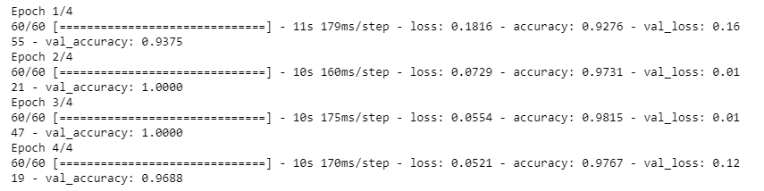

# Mask Detection
Many measurements have been taken to tackle the COVID-19 pandemic. Among which wearing mask is one way to prevent spreading the virus. The aim of this work is to detect if a person is wearing a mask or not. With this objective, a machine learning model is developed which leverages transfer learning to detect face mask. The training data for this model is collected from multiple sources.  

For collecting human faces with mask, a subset (1000 images) of the MAFA dataset is used. 
The dataset can be found in http://www.escience.cn/people/geshiming/mafa.html 
For collecting human faces without mask, a subset of (1000 images) the UTKFace dataset is used. 
The dataset can be found in https://susanqq.github.io/UTKFace/  

Finally, the trained model is used to detect human face with/without face mask in real time using webcam feed.

• Keras is used to develop the model.  
• Resnet-50 is used to train the model.  
• Data augmentation (horizontal and vertical shift, flip) is performed as a preprocessing step.  
• 99% accuracy is achieved while testing with hold-out images.  
• OpenCV is used to detect face mask in real time. 

# Training Data
The training data of this model can be found in the following link: 
https://www.dropbox.com/sh/20zrofhd10f3dev/AACBL2j6I4fu9KrDLBhWI5U2a?dl=0

# Performance

# How to run:
For code and performance, check the maskDetection.ipynb file. To run the face mask detection applicaiton a webcam must be plugged in. Run the MaskOrNot.py file 
